# openCH 赤菟 开发板 开发资源 v1.1.0

- [openCH 赤菟 开发板 开发资源 v1.1.0](#opench-赤菟-开发板-开发资源-v110)
	- [简介](#简介)
		- [板载资源](#板载资源)
		- [CH32V307VCT6](#ch32v307vct6)
	- [硬件版本历史](#硬件版本历史)
		- [v1.1](#v11)
		- [v1.0](#v10)
	- [仓库目录结构](#仓库目录结构)
	- [开发环境](#开发环境)
		- [例程简介](#例程简介)
		- [MounRiver Studio (MRS)](#mounriver-studio-mrs)
			- [基于本仓库的 MRS 例程建立新项目](#基于本仓库的-mrs-例程建立新项目)
				- [方法一 在例程旁边建立项目（推荐）](#方法一-在例程旁边建立项目推荐)
				- [方法二 使用 MRS 的导出功能](#方法二-使用-mrs-的导出功能)
		- [RT-Thread Studio](#rt-thread-studio)
		- [CMake](#cmake)
	- [引脚分配](#引脚分配)
	- [开发资源](#开发资源)

## 简介

***此为 赤菟 v1.1 版的开发资源，支持赤菟 v1.1.x 硬件。现正持续更新中。  
旧版 v1.0.x 硬件对应的开发资源仓库为：<https://gitee.com/verimaker/opench-ch32v307/tree/v1.0.3>  
硬件版本修改信息见[硬件版本历史章节](#硬件版本历史)***  

openCH 赤菟 开发板 是 VeriMake 设计生产的、基于 RISC-V MCU 的嵌入式开发板，搭载 CH32V307 芯片，有丰富的外设。  
**原理图**、**尺寸与元件位号图**、**3D 模型**等资料见 [***开发资源章节***](#开发资源)  
**引脚定义** 见 [***引脚分配章节***](#引脚分配)  
VeriMake 会在 [***Bilibili 账号***](https://space.bilibili.com/356383684) 上发布相关的教程、应用案例视频。  
VeriMake 论坛也有专门的 [***赤菟版块***](https://verimake.com/t/Chitu) 供开发者发帖展示相关项目、分享开发经验、提出开发过程中遇到问题等。  
相关硬件可以从 [***VeriMake的淘宝店***](https://verimake.taobao.com/) 购买。  


### 板载资源

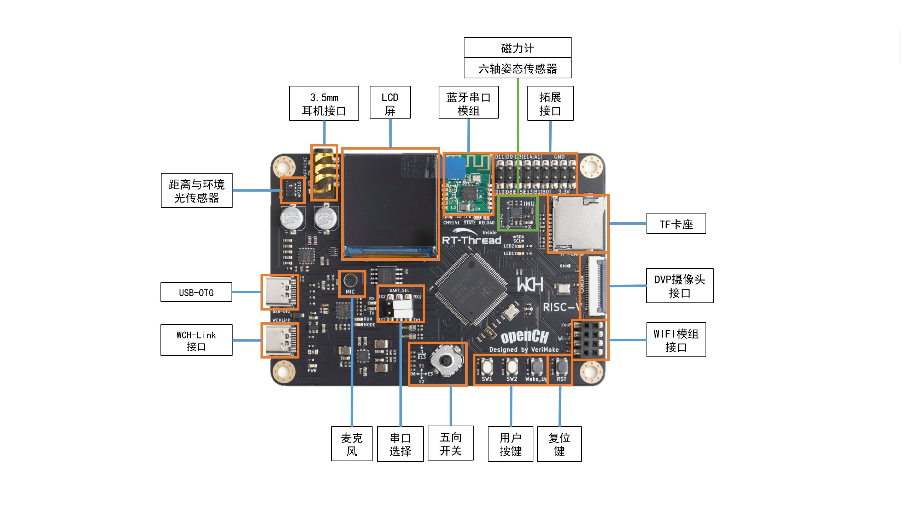

- CH32V307VCT6
- ES8388 音频采集与播放
- AP3216C 距离与环境光传感器 (ALS&PS)
- 128 Mbit 板载 Flash
- Type-C USB 接口
- 板载 WCH-Link 调试器
- 两个用户 LED，一个五向开关 和 三个用户按键，支持睡眠唤醒
- 六轴重力与加速度传感器
- 磁力计
- 硬件 TF 卡 (micro-SD) 接口
- 硬件 DVP 摄像头接口，支持 OV2640 模组
- 1.33 寸 240x240 分辨率 LCD 屏，主控 ST7789，FSMC 控制
- 11 个拓展 GPIO 端口
- CH9141 BLE 透传模组，主从一体
  
>注：由于引脚冲突，部分功能不能同时使用：  
>- 使用DVP 摄像头时，UART1、TF 卡、以太网 不能使用
>- 使用以太网模块时， DVP 摄像头、ES8388（I2S 音频芯片）、TF 卡 不能使用
  
### CH32V307VCT6

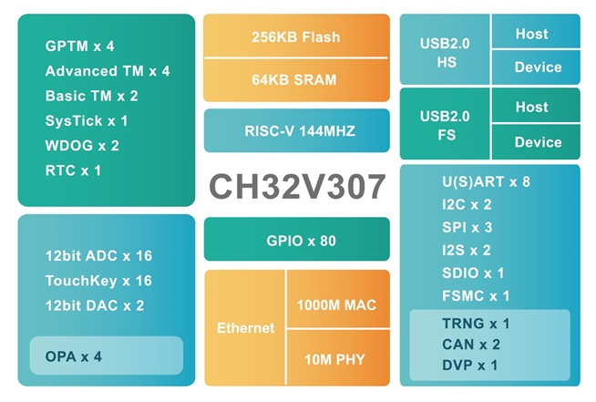

- RISC-V4F 处理器，最高 144MHz 系统主频
- 支持单周期乘法和硬件除法，支持硬件浮点运算 ( FPU )
- 64 KB SRAM，256 KB Flash
- 供电电压：2.5/3.3 V，GPIO 单元独立供电
- 多种低功耗模式：睡眠、停止、待机
- 上/下电复位、可编程电压检测器
- 2 组 18 路通用 DMA
- 4 组运放比较器
- 1 个随机数发生器 TRNG
- 2 组 12 位 DAC 转换
- 2 单元 16 通道 12 位 ADC 转换，16 路触摸按键 TouchKey
- 10 组定时器
- USB2.0 全速 OTG 接口
- USB2.0 高速主机/设备接口（ 480 Mbps 内置 PHY ）
- 3 个 USART 接口和 5 个 UART 接口
- 2 个 CAN 接口（ 2.0B 主动）
- SDIO 接口、FSM C接口、DVP 数字图像接口
- 2 组 IIC 接口、3 组 SPI 接口、2 组 IIS 接口
- 千兆以太网控制器 ETH（内置 10M PHY ）
- 80 个 I/O 口，可以映射到16外部中断
- CRC 计算单元，96 位芯片唯一 ID
- 串行 2 线调试接口
- 封装形式：LQFP64M、LQFP100

## 硬件版本历史

硬件版本号位于开发板正面的左下角、电源指示灯 PWR 的下方：
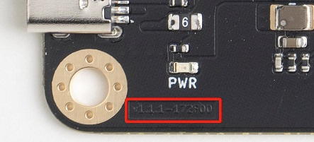

### v1.1

从 v1.0 到 v1.1 的更改有：

  1. 去除 AHT10 温湿度传感器
  2. 增加 QMC7983 磁力计
  3. IMU 从 MPU6050 更改为 QMI8658A
  4. ES8388 的 LIN2/RIN2 连接到耳机座的 Sleeve，可以使用常见耳机的麦克风录音。
  5. DVP 接口晶振从 12MHz 更换为 24MHz。

- v1.1.1 最新版。
- v1.1.0 测试版本

### v1.0

v1.0.x 硬件对应的开发资源仓库为：<https://gitee.com/verimaker/opench-ch32v307/tree/v1.0.3>

- v1.0.3 仅细微调整，FPC 座改为翻盖式。
- v1.0.2 仅细微调整。
- v1.0.1 仅细微调整。
- v1.0.0 第一个发售版本。

## 仓库目录结构

```shell
.
|-- doc (存放原理图、尺寸与元件位号图、文档图片等资料)
`-- firmware (例程与库)
    |-- Camera
    |-- ...(其它例程)
    `-- SRC ( CH32V307 库文件)
```

## 开发环境

openCH 赤菟 支持 MounRiver Studio (MRS) ， RT-Thread Studio 亦或是CMake开发

### 例程简介

注：例程在 `firmware` 文件夹中

| 例程名                             | 开发环境         | 简介                   |
| ---------------------------------- | ---------------- | ---------------------- |
| Camera                             | MRS              | OV2640摄像头例程       |
| CH32V307_RTT_VC_RC_by_es8388       | RT-Thread Studio | RT-Thread 语音识别例程 |
| GreedySnake_Net\GreedySnake_Client | MRS              | 贪吃蛇例程，客户端     |
| GreedySnake_Net\GreedySnake_Server | MRS              | 贪吃蛇例程，服务器端   |
| IIC_Sensor                         | MRS              | I2C 传感器例程         |
| Integrated_Test                    | MRS              | 出厂程序               |
| KEY_TEST                           | MRS              | 按键例程               |
| LCD_LVGL                           | MRS              | LVGL图形库例程         |
| Record_Play                        | MRS              | ES8388录放音例程       |
| RTT_RNG_Lottery                    | RT-Thread Studio | 随机抽奖例程           |
| SPI_Flash                          | MRS              | 片外FLASH例程          |
| TcpClient                          | MRS              | TCP 客户端例程         |
| USART/BLE_Serial                   | MRS              | CH9141蓝牙串口例程     |
| USART/Basic                        | MRS              | 串口轮询例程           |
| USART/UART_DMA                     | MRS              | 串口DMA例程            |
| USART/Wifi_ESP8266                 | MRS              | Wi-Fi 模组例程         |
| VoiceRcgExam                       | MRS              | 裸机语音识别例程       |

### MounRiver Studio (MRS)

大多数例程使用 MRS 开发：[***MRS 上手教程***](https://verimake.com/d/12-ch32v307-mrs)  【[***视频***](https://www.bilibili.com/video/BV1wq4y1m7JD/)】  
MRS 的介绍和软件资源在：[***MRS 官网***](http://www.mounriver.com/)  

#### 基于本仓库的 MRS 例程建立新项目

本仓库中 MRS 例程的部分依赖文件放置于 `firmware/SRC` 文件夹中，单独复制例程到其它位置可能无法使用。  
可用以下方法基于本仓库例程建立新项目：（本仓库的结构与沁恒官方的 CH32V307 `EVT` 类似，下面的方法也适用于 `EVT` 中的例程）  

##### 方法一 在例程旁边建立项目（推荐）

以此方法建立的项目 ***不可移动或复制到其它位置使用***。  
此处将示范以 `UART_Basic` 为基础，建立新项目：

1. 打开 `UART_Basic` 例程，在 `项目资源管理器` 中 右击 `UART_Basic`，选择 `复制`。（或者使用 `Ctrl C`)  
   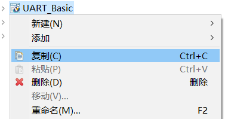
2. 右击空白处，选择 `粘贴` （或者使用 `Ctrl V`)  
   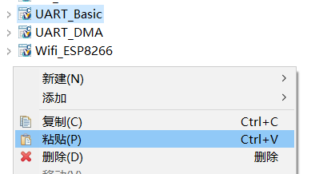
3. 在弹出的对话框中修改项目名称，取消勾选 `使用缺省位置` 后，点击 `浏览`  
   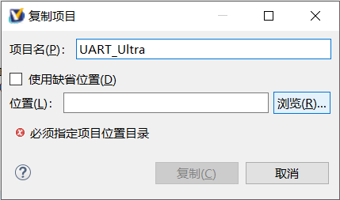
4. 到本项目的上一级目录中（此处是 `UART_Basic` 所在的 `USART` 文件夹中），新建文件夹并改名为项目名称  
   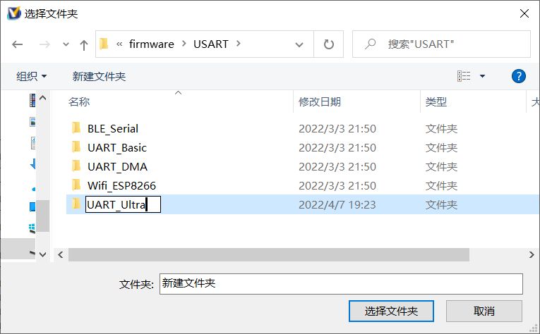
5. 选择新文件夹，返回对话框，点击 `复制`，就完成了。  
   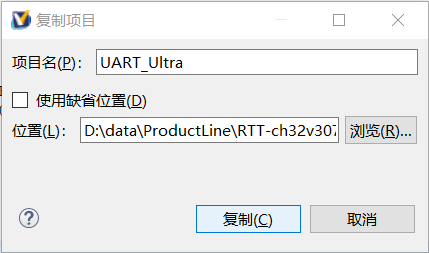
6. 新项目编译通过  
   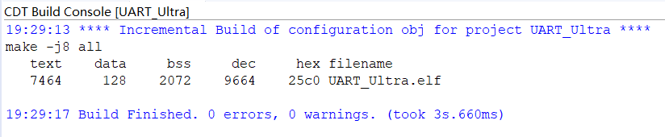

##### 方法二 使用 MRS 的导出功能

以此方法导出的项目与原项目同名，***可以移动或复制到其它位置使用***。  
此处示范导出 `UART_Basic`：

1. 打开 `UART_Basic` 例程，在 `项目资源管理器` 中 右击 `UART_Basic`，选择 `导出`。  
   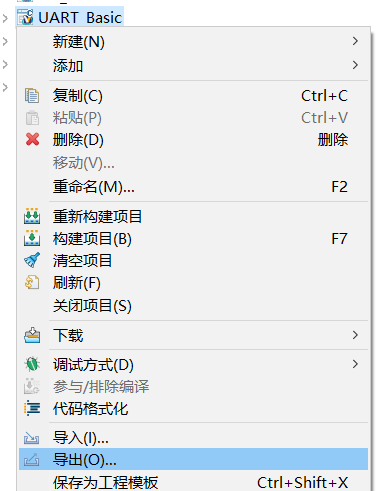
2. 在弹出的对话框中选择 `常规` 分组中的 `文件系统`，点击 下一步  
   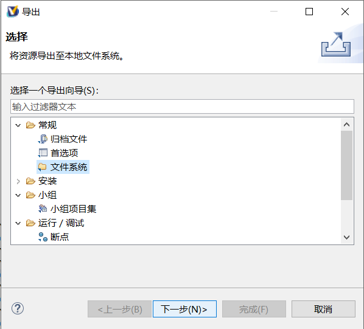
3. 选择 `UART_Basic`，在 `选项` 中勾选 `创建文件的目录结构` 和 `解析并导出已连接资源`；再点击 `浏览` ，选择项目导出位置  
   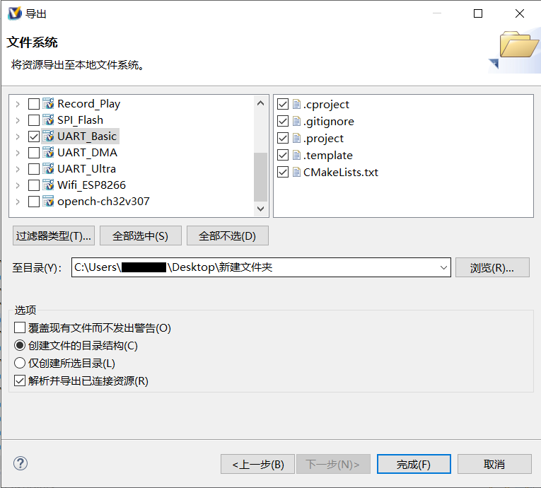
4. 点击 `完成`，即可完成项目导出。导出的项目包含所有的依赖文件。  
   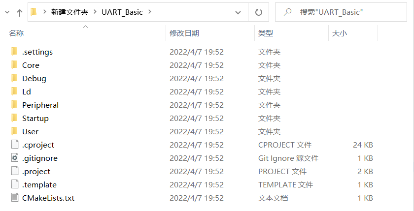
5. 导出的项目没有项目入口，可以通过 MRS 的 `加载` 功能打开（`文件` -> `加载`）。注意，加载的项目会覆盖 `项目资源管理器` 中的同名项目。  
   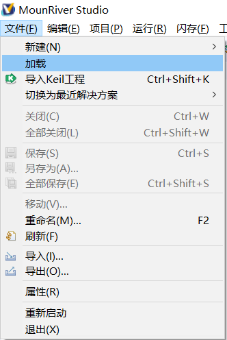
6. 在弹出的对话框中选择 `工程`，点击 `浏览`  
   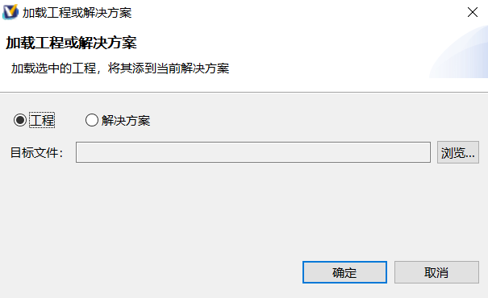
7. 到导出的项目文件夹中，选择根目录下的 `.projuct` 文件，点击 `打开`  
   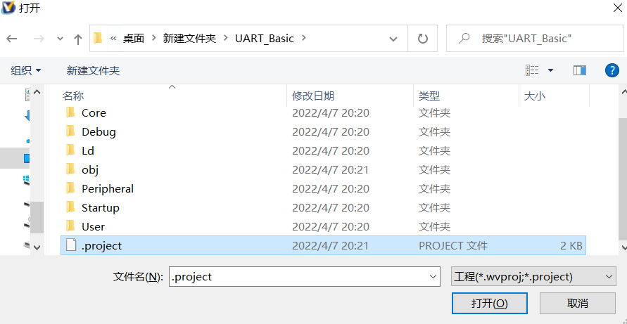
8. 返回对话框，点击 `确定`。如提示覆盖相同名称的工程，可选 `是`  
   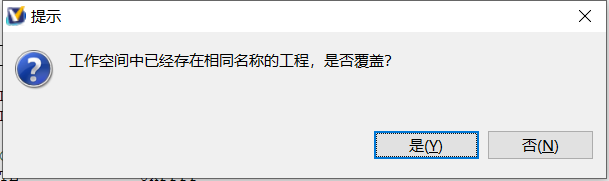
9. 项目已导入，但一些文件夹仍处于未链接状态（带感叹号`!`）。需要将它们从项目中删除  
   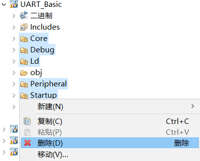
10. 此时编译，项目下会多出一些文件夹，且编译可以通过  
   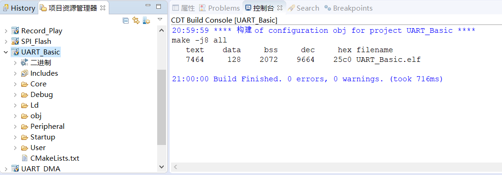

### RT-Thread Studio

基于 RT-Thread 操作系统的工程可以使用 RT-Thread Studio 开发  
[***RT-Thread Studio 编译 语音识别例程***](https://verimake.com/d/13-ch32v307-2021rtt-demo) 【[***视频***](https://www.bilibili.com/video/BV1bL4y1n797)】  
[***RT-Thread Studio 下载***](https://www.rt-thread.org/page/studio.html)  

### CMake

配置好 [***`CMake`***](https://cmake.org/) 和 [***`ninja`***](https://ninja-build.org/) , 开启你的赤菟之旅.

- 键入`make build APP=Integrated_Test`编译工程，二进制文件将输出到`./cmake_output`路径下.`APP`参数替换成你想操作的工程
- 键入`make program APP=Integrated_Test`将二进制文件下载至 赤菟。
- 键入`make build_elipse APP=Intergrated_Test`输出eclipse工程到`./build.eclipse`路径，可直接导入MRS，RTT-studio等eclipse环境开发。

*详细参考 : [**CH32V307教程 [番外] [开发环境-CMake] 赤菟CH32V307**](https://verimake.com/d/14-ch32v307-cmake-ch32v307)*

## 引脚分配

注：由于引脚冲突，部分功能不能同时使用：

- 使用DVP 摄像头时，UART1、TF 卡、以太网 不能使用
- 使用以太网模块时， DVP 摄像头、ES8388（I2S 音频芯片）、TF 卡 不能使用

| 端口功能             | 引脚名  | 功能       | 备注                                                              |
| -------------------- | ------- | ---------- | ----------------------------------------------------------------- |
| 按键                 | PA0     | Wake_Up    | 按下输入1                                                         |
|                      | PE4     | SW1        | 按下输入0                                                         |
|                      | PE5     | SW2        | 按下输入0                                                         |
| 五向开关             | PE1     | JOY_UP     | 按下输入0                                                         |
|                      | PE2     | JOY_DOWN   | 按下输入0                                                         |
|                      | PD6     | JOY_LEFT   | 按下输入0                                                         |
|                      | PE3     | JOY_RIGHT  | 按下输入0                                                         |
|                      | PD13    | JOY_SEL    | 按下输入0                                                         |
| LED                  | PE11    | LED1       | 输出0点亮                                                         |
|                      | PE12    | LED2       | 输出0点亮                                                         |
| 串口1                | PA9     | UART1_TX   | 复用：DVP_D0                                                      |
|                      | PA10    | UART1_RX   | 复用：DVP_D1                                                      |
| 串口2                | PA2     | UART2_TX   | 通过跳线帽选择调试器串口连接UART1或者UART2                        |
|                      | PA3     | UART2_RX   | 通过跳线帽选择调试器串口连接UART1或者UART2                        |
| WiFi 接口            | PC0     | UART6_TX   | ESP8266_RX <兼容 ESP-01，ESP-01S WiFi 模块>                       |
|                      | PC1     | UART6_RX   | ESP8266_TX <使用时注意 WiFi 天线朝向板外>                         |
| 蓝牙 CH9141          | PC2     | UART7_TX   | CH9141_RX                                                         |
|                      | PC3     | UART7_RX   | CH9141_TX                                                         |
|                      | PA7     | BLE_AT     | BLE控制管脚 0为AT模式，1为透传模式                                |
|                      | PC13    | BLE_SLEEP  | 低电平有效，低功耗模式                                            |
| 液晶屏LCD            | PD14    | FSMC_D0    | 液晶  LCD 数据口D0                                                |
|                      | PD15    | FSMC_D1    | 液晶  LCD 数据口D1                                                |
|                      | PD0     | FSMC_D2    | 液晶  LCD 数据口D2                                                |
|                      | PD1     | FSMC_D3    | 液晶  LCD 数据口D3                                                |
|                      | PE7     | FSMC_D4    | 液晶  LCD 数据口D4                                                |
|                      | PE8     | FSMC_D5    | 液晶  LCD 数据口D5                                                |
|                      | PE9     | FSMC_D6    | 液晶  LCD 数据口D6                                                |
|                      | PE10    | FSMC_D7    | 液晶  LCD 数据口D7                                                |
|                      | PD4     | FSMC_NOE   | 液晶  LCD_RD                                                      |
|                      | PD5     | FSMC_NWE   | 液晶  LCD_WR                                                      |
|                      | PD7     | FSMC_NE1   | 液晶  LCD_CS                                                      |
|                      | PD12    | FSMC_A17   | 液晶  LCD_DC                                                      |
|                      | RST     | 复位       | 液晶  LCD_RESET                                                   |
|                      | PB14    | LCD_BL     | 液晶背光开关，高电平有效                                          |
|                      | PC4     | LCD_TE     | 液晶 Tearing Effect 输出（帧同步）                                |
| 摄像头 DVP           | PA9     | DVP_D0     | 复用：UART1_TX                                                    |
|                      | PA10    | DVP_D1     | 复用：UART1_RX                                                    |
|                      | PC8     | DVP_D2     | 复用：TF卡  D0 , 以太网模块 TX+                                   |
|                      | PC9     | DVP_D3     | 复用：TF卡  D1 , 以太网模块 TX-                                   |
|                      | PC11    | DVP_D4     | 复用：TF卡  D3                                                    |
|                      | PB6     | DVP_D5     |                                                                   |
|                      | PB8     | DVP_D6     | 复用：以太网模块 绿灯                                             |
|                      | PB9     | DVP_D7     | 复用：以太网模块 黄灯                                             |
|                      | PC10    | DVP_D8     | 复用：TF卡  D2                                                    |
|                      | PC12    | DVP_D9     | 复用：TF卡  CLK                                                   |
|                      | PB7     | DVP_RESSET |                                                                   |
|                      | PA4     | DVP_HSYN   |                                                                   |
|                      | PA5     | DVP_VSYNC  |                                                                   |
|                      | PA6     | DVP_PCLK   |                                                                   |
|                      | PC7     | DVP_PWDN   | 复用：以太网模块 RX-                                              |
|                      | PB10    | SCCB_SCL   | 复用： DVP QMI8658A ES8388 QMC7983 AP3216C                        |
|                      | PB11    | SCCB_SDA   | 复用： DVP QMI8658A ES8388 QMC7983 AP3216C                        |
| MP3 ES8388           | PB12    | I2S2_LRCK  |                                                                   |
|                      | PB13    | I2S2_SCLK  |                                                                   |
|                      | PB15    | I2S2_SD    |                                                                   |
|                      | PC6     | I2S2_MCLK  | 复用：以太网模块 RX+                                              |
|                      | PA8     | AUDIO_CTL  | I2S数据方向控制；1 : ES8388 -> MCU，录音；0 : MCU -> ES8388，播放 |
|                      | PB10    | I2C2_SCL   | 复用：DVP QMI8658A ES8388 QMC7983 AP3216C                         |
|                      | PB11    | I2C2_SDA   | 复用：DVP QMI8658A ES8388 QMC7983 AP3216C                         |
| TF卡                 | PC8     | SD_D0      | 复用：DVP , 以太网模块 TX+                                        |
|                      | PC9     | SD_D1      | 复用：DVP , 以太网模块 TX-                                        |
|                      | PC10    | SD_D2      | 复用：DVP                                                         |
|                      | PC11    | SD_D3      | 复用：DVP                                                         |
|                      | PC12    | SD_CLK     | 复用：DVP                                                         |
|                      | PD2     | SD_CMD     |                                                                   |
| FLASH                | PA15    | SPI3_CS    |                                                                   |
|                      | PB3     | SPI3_CLK   |                                                                   |
|                      | PB4     | SPI3_MISO  |                                                                   |
|                      | PB5     | SPI3_MOSI  |                                                                   |
| IMU QMI8658A         | PB10    | I2C2_SCL   | 复用： DVP QMI8658A ES8388 QMC7983 AP3216C                        |
|                      | PB11    | I2C2_SDA   | 复用： DVP QMI8658A ES8388 QMC7983 AP3216C                        |
|                      | PC5     | IMU_INT    | 连接到 QMI8658A 的 INT1                                           |
| 磁力计 QMC7983       | PB10    | I2C2_SCL   | 复用： DVP QMI8658A ES8388 QMC7983 AP3216C                        |
|                      | PB11    | I2C2_SDA   | 复用： DVP QMI8658A ES8388 QMC7983 AP3216C                        |
| 环境光传感器 AP3216C | PB10    | I2C2_SCL   | 复用： DVP QMI8658A ES8388 QMC7983 AP3216C                        |
|                      | PB11    | I2C2_SDA   | 复用： DVP QMI8658A ES8388 QMC7983 AP3216C                        |
|                      | PE6     | AP_INT     |                                                                   |
| USB                  | PA11    | USB1_D-    |                                                                   |
|                      | PA12    | USB1_D+    |                                                                   |
| 调试器接口           | PA13    | SWDIO      | 调试器专用                                                        |
|                      | PA14    | SWCLK      | 调试器专用                                                        |
| 外部晶振             | PC14    | OSC32_IN   | 32.768KHz 专用                                                    |
|                      | PC15    | OSC32_OUT  | 32.768KHz 专用                                                    |
|                      | OSC_IN  |            | 外部晶振 8MHz                                                     |
|                      | OSC_OUT |            | 外部晶振 8MHz                                                     |
| BOOT                 | BOOT0   |            | 默认为0 。 短接跳线焊盘后为1                                      |
|                      | PB2     | BOOT1      | 默认为0 。 短接跳线焊盘后为1                                      |
| 扩展口               | PB0     | ADC_IN8    | 可用作：TIM3_CH3 / TIM8_CH2N / OPA1_CH1P等                        |
|                      | PB1     | ADC_IN9    | 可用作：TIM3_CH4 / TIM8_CH3N / OPA4_CH0N 等                       |
|                      | PA1     | ADC_IN1    | 可用作：TIM5_CH2 / TIM2_CH2 / OPA3_OUT0 等                        |
|                      | PE13    | FSMC_D10   | 重映射功能：TIM1_CH3/UART7_RX                                     |
|                      | PE14    | FSMC_D11   | 重映射功能：TIM1_CH4/UART8_TX                                     |
|                      | PE15    | FSMC_D12   | 重映射功能：TIM1_BKIN/UART8_RX                                    |
|                      | PD3     | FSMC_CLK   | 重映射功能：USART2_CTS TIM10_CH2                                  |
|                      | PD8     | FSMC_D13   | 重映射功能：USART3_TX/TIM9_CH1N                                   |
|                      | PD9     | FSMC_D14   | 重映射功能：USART3_RX TIM9_CH1/TIM9_ETR                           |
|                      | PD10    | FSMC_D15   | 重映射功能：USART3_CK/TIM9_CH2N                                   |
|                      | PD11    | FSMC_A16   | 重映射功能：USART3_CTS/TIM9_CH2                                   |

## 开发资源

- [***openCH 赤菟开发板原理图***](./doc/SCH_openCH_ChiTu_v1.1.1.pdf)
- [***openCH 赤菟开发板尺寸及元件位号图***](./doc/Dimension_openCH_ChiTu_v1.1.1.pdf)
- [***openCH 赤菟开发板 3D 模型***](./doc/3d_openCH_ChiTu_v1.1.1_%E4%BB%85%E4%BE%9B%E5%8F%82%E8%80%83.step)
- [***CH32V307 介绍页面 (WCH)***](http://www.wch.cn/products/CH32V307.html)
- [***CH32V307 沁恒官方例程（用于赤菟开发板时需修改）***](http://www.wch.cn/downloads/CH32V307EVT_ZIP.html)  
- [***CH32V307 芯片手册 (WCH)***](http://www.wch.cn/downloads/CH32V20x_30xDS0_PDF.html)
- [***CH32V307 参考手册 (WCH)***](http://www.wch.cn/downloads/CH32FV2x_V3xRM_PDF.html)
- [***QMI8658 芯片手册***](./doc/QMI8658A_Datasheet_Rev_A.pdf)
- [***QMC7983 芯片手册***](./doc/QMC7983%20Datasheet%20-NCP-Rev1.0.pdf)
  